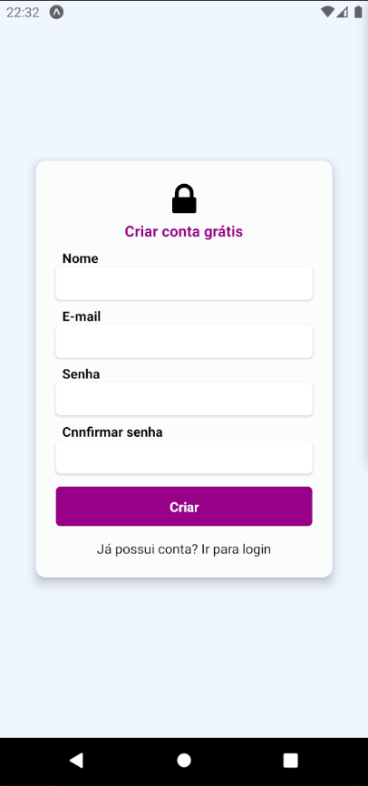
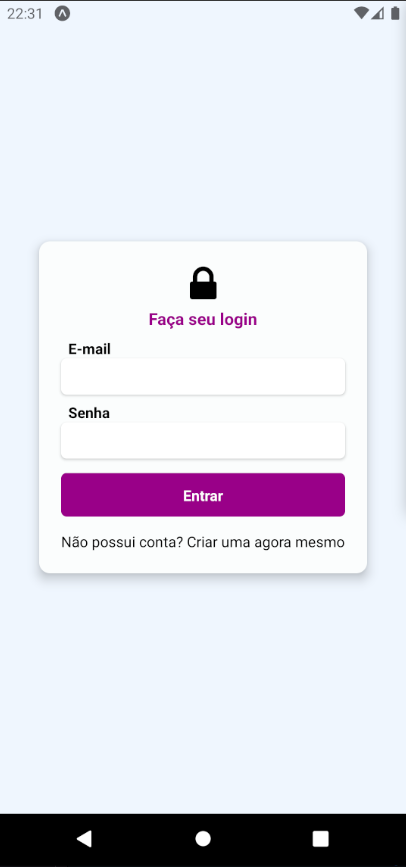
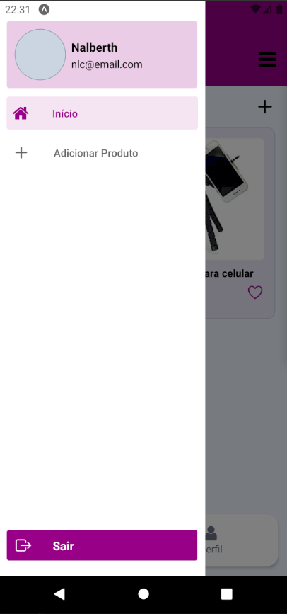
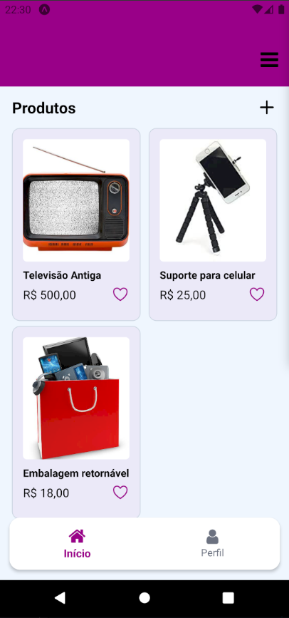

# Expo App: Autenticação + Navegação

## Descrição

Criando app com Expo utilizando `create-expo-stack` conforme a documentação https://createexpostack.com.

Implentação de autenticação e das estratégias de navegação mobile: _Drawer Navigator_ e _Botton Navigation_.

## Resultados

## Executar o projeto

Para executar o projeto é primeiro rodar o servidor e em seguida atualizar o endereço de conexão do servidor no serviços do em `mobile/src/services/api.ts`.

Servidor backend:

`yarn`

`yarn dev`

Aplicação mobile em desenvolvimento:

`yarn`

`yarn start`
